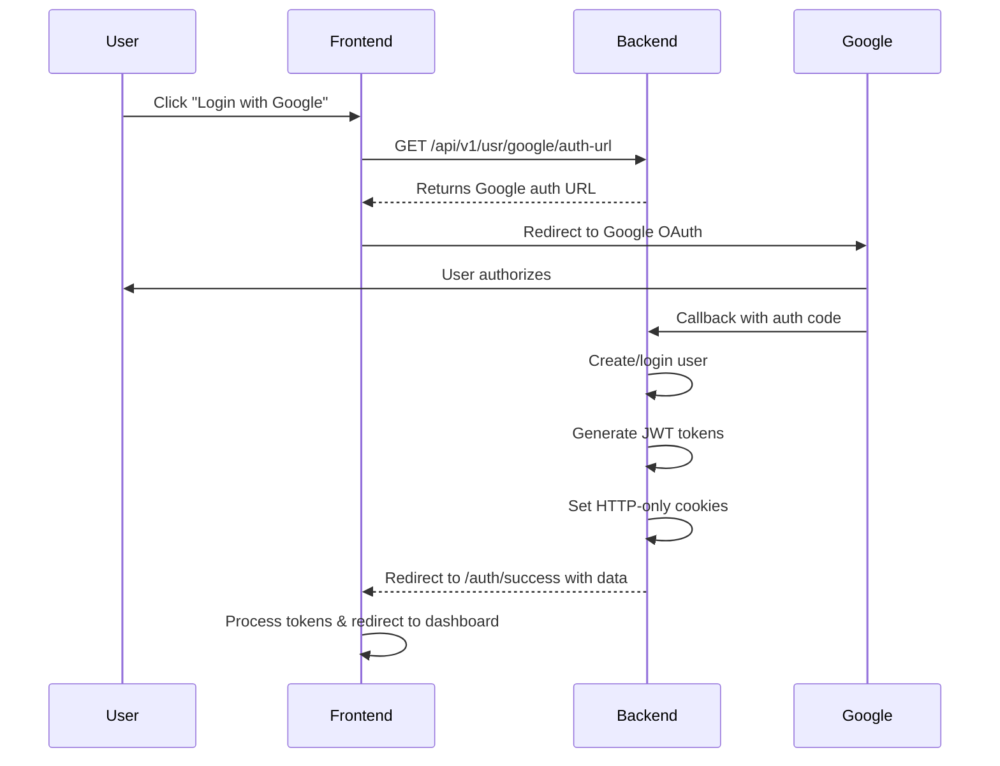

# Frontend Google OAuth Integration Guide

## 🎯 Overview

This document explains how the frontend should handle Google OAuth authentication after the backend callback. The backend handles all OAuth processing and redirects users to the frontend with authentication data.

## 🔄 OAuth Flow



## 🛠️ Implementation Steps

### 1. Create Auth Success Route

Your frontend needs a route to handle the OAuth callback:

**URL:** `https://app.pilito.com/auth/success`

### 2. Handle Callback Data

After successful OAuth, users are redirected to:
```
https://app.pilito.com/auth/success?success=true&data=<base64_encoded_data>
```

### 3. React Implementation Example

```jsx
// pages/AuthSuccess.jsx
import { useEffect, useState } from 'react';
import { useNavigate } from 'react-router-dom';

function AuthSuccess() {
    const navigate = useNavigate();
    const [loading, setLoading] = useState(true);

    useEffect(() => {
        handleOAuthCallback();
    }, []);

    const handleOAuthCallback = async () => {
        try {
            const urlParams = new URLSearchParams(window.location.search);
            
            // Check if OAuth was successful
            if (urlParams.get('success') === 'true') {
                await processSuccessfulAuth(urlParams);
            } else {
                handleAuthError();
            }
        } catch (error) {
            console.error('OAuth processing error:', error);
            handleAuthError();
        } finally {
            setLoading(false);
        }
    };

    const processSuccessfulAuth = async (urlParams) => {
        try {
            // Method 1: Extract data from URL parameters
            const encodedData = urlParams.get('data');
            const authData = JSON.parse(atob(encodedData));
            
            console.log('✅ OAuth Success Data:', authData);
            
            // Store authentication data
            localStorage.setItem('access_token', authData.access_token);
            localStorage.setItem('refresh_token', authData.refresh_token);
            
            // Store user information
            const userInfo = {
                user_id: authData.user_id,
                email: authData.email,
                first_name: authData.first_name,
                last_name: authData.last_name,
                wizard_complete: authData.wizard_complete
            };
            localStorage.setItem('user', JSON.stringify(userInfo));
            
            // Method 2: Also read from cookies (backup method)
            readUserInfoFromCookies();
            
            // Test authentication
            await testAuthentication();
            
            // Redirect based on user state
            if (authData.wizard_complete) {
                navigate('/dashboard');
            } else {
                navigate('/wizard'); // or onboarding flow
            }
            
        } catch (error) {
            console.error('Failed to process auth data:', error);
            throw error;
        }
    };

    const readUserInfoFromCookies = () => {
        try {
            const userInfoCookie = getCookie('USER_INFO');
            if (userInfoCookie) {
                const cookieUserData = JSON.parse(atob(userInfoCookie));
                console.log('📦 User info from cookie:', cookieUserData);
                
                // Use cookie data as backup or validation
                const existingUser = JSON.parse(localStorage.getItem('user') || '{}');
                if (!existingUser.email && cookieUserData.email) {
                    localStorage.setItem('user', JSON.stringify(cookieUserData));
                }
            }
        } catch (error) {
            console.warn('Could not read user info from cookies:', error);
        }
    };

    const testAuthentication = async () => {
        try {
            // Test if authentication is working
            const response = await fetch('https://api.pilito.com/api/v1/usr/auth/status', {
                credentials: 'include', // Include HTTP-only cookies
                headers: {
                    'Authorization': `Bearer ${localStorage.getItem('access_token')}`,
                    'Content-Type': 'application/json'
                }
            });
            
            if (response.ok) {
                const statusData = await response.json();
                console.log('✅ Authentication test successful:', statusData);
            } else {
                console.warn('⚠️ Authentication test failed:', response.status);
            }
        } catch (error) {
            console.warn('Authentication test error:', error);
        }
    };

    const handleAuthError = () => {
        console.error('❌ OAuth authentication failed');
        navigate('/login?error=oauth_failed');
    };

    if (loading) {
        return (
            <div className="auth-success-loading">
                <h2>🔐 Completing your login...</h2>
                <p>Please wait while we set up your account.</p>
                <div className="spinner">⏳</div>
            </div>
        );
    }

    return null; // Should not reach here if redirect works
}

// Utility function to read cookies
function getCookie(name) {
    const value = `; ${document.cookie}`;
    const parts = value.split(`; ${name}=`);
    if (parts.length === 2) return parts.pop().split(';').shift();
    return null;
}

export default AuthSuccess;
```

### 4. API Request Helper

Create a helper for authenticated API requests:

```javascript
// utils/api.js
class ApiClient {
    constructor() {
        this.baseURL = 'https://api.pilito.com/api/v1';
    }

    async request(endpoint, options = {}) {
        const url = `${this.baseURL}${endpoint}`;
        const token = localStorage.getItem('access_token');
        
        const config = {
            ...options,
            headers: {
                'Content-Type': 'application/json',
                ...(token && { 'Authorization': `Bearer ${token}` }),
                ...options.headers
            },
            credentials: 'include' // Always include cookies
        };

        try {
            const response = await fetch(url, config);
            
            // Handle token expiration
            if (response.status === 401) {
                await this.refreshToken();
                // Retry the original request
                const retryConfig = {
                    ...config,
                    headers: {
                        ...config.headers,
                        'Authorization': `Bearer ${localStorage.getItem('access_token')}`
                    }
                };
                return fetch(url, retryConfig);
            }
            
            return response;
        } catch (error) {
            console.error('API request failed:', error);
            throw error;
        }
    }

    async refreshToken() {
        try {
            const refreshToken = localStorage.getItem('refresh_token');
            const response = await fetch(`${this.baseURL}/usr/refresh`, {
                method: 'POST',
                headers: { 'Content-Type': 'application/json' },
                body: JSON.stringify({ refresh: refreshToken }),
                credentials: 'include'
            });

            if (response.ok) {
                const data = await response.json();
                localStorage.setItem('access_token', data.data.access_token);
                localStorage.setItem('refresh_token', data.data.refresh_token);
                console.log('✅ Token refreshed successfully');
            } else {
                throw new Error('Token refresh failed');
            }
        } catch (error) {
            console.error('Token refresh failed:', error);
            this.logout();
        }
    }

    logout() {
        localStorage.removeItem('access_token');
        localStorage.removeItem('refresh_token');
        localStorage.removeItem('user');
        window.location.href = '/login';
    }

    // Convenience methods
    get(endpoint, options = {}) {
        return this.request(endpoint, { ...options, method: 'GET' });
    }

    post(endpoint, data, options = {}) {
        return this.request(endpoint, {
            ...options,
            method: 'POST',
            body: JSON.stringify(data)
        });
    }

    put(endpoint, data, options = {}) {
        return this.request(endpoint, {
            ...options,
            method: 'PUT',
            body: JSON.stringify(data)
        });
    }

    delete(endpoint, options = {}) {
        return this.request(endpoint, { ...options, method: 'DELETE' });
    }
}

export const apiClient = new ApiClient();
```

### 5. Router Configuration

Add the auth success route to your router:

```jsx
// App.jsx or Router.jsx
import { BrowserRouter as Router, Routes, Route } from 'react-router-dom';
import AuthSuccess from './pages/AuthSuccess';

function App() {
    return (
        <Router>
            <Routes>
                <Route path="/login" element={<Login />} />
                <Route path="/auth/success" element={<AuthSuccess />} />
                <Route path="/dashboard" element={<Dashboard />} />
                <Route path="/wizard" element={<OnboardingWizard />} />
                {/* other routes */}
            </Routes>
        </Router>
    );
}
```

### 6. Google Login Button

Update your login button to use the backend OAuth URL:

```jsx
// components/GoogleLoginButton.jsx
import { useState } from 'react';

function GoogleLoginButton() {
    const [loading, setLoading] = useState(false);

    const handleGoogleLogin = async () => {
        try {
            setLoading(true);
            
            // Get Google auth URL from backend
            const response = await fetch('https://api.pilito.com/api/v1/usr/google/auth-url');
            const data = await response.json();
            
            if (data.auth_url) {
                // Redirect to Google OAuth
                window.location.href = data.auth_url;
            } else {
                throw new Error('Failed to get auth URL');
            }
        } catch (error) {
            console.error('Google login failed:', error);
            setLoading(false);
        }
    };

    return (
        <button 
            onClick={handleGoogleLogin} 
            disabled={loading}
            className="google-login-btn"
        >
            {loading ? (
                <>⏳ Connecting to Google...</>
            ) : (
                <>🔐 Continue with Google</>
            )}
        </button>
    );
}
```

## 📊 Data Structures

### OAuth Success Data (URL Parameter)

The `data` parameter contains base64-encoded JSON:

```javascript
{
    "access_token": "eyJ0eXAiOiJKV1QiLCJhbGciOiJIUzI1NiJ9...",
    "refresh_token": "eyJ0eXAiOiJKV1QiLCJhbGciOiJIUzI1NiJ9...",
    "user_id": 123,
    "email": "user@example.com", 
    "first_name": "John",
    "last_name": "Doe",
    "wizard_complete": false,
    "success": true
}
```

### User Info Cookie

The `USER_INFO` cookie contains base64-encoded JSON:

```javascript
{
    "user_id": 123,
    "email": "user@example.com",
    "first_name": "John", 
    "last_name": "Doe",
    "wizard_complete": false
}
```

## 🍪 Cookie Information

The backend sets these cookies automatically:

| Cookie | Type | Purpose | Duration |
|--------|------|---------|----------|
| `HTTP_ACCESS` | HTTP-only | JWT access token | 7 days |
| `HTTP_REFRESH` | HTTP-only | JWT refresh token | 30 days |
| `USER_INFO` | Regular | User data for frontend | 7 days |

## 🔍 Testing & Debugging

### Test OAuth Flow

1. **Get auth URL:**
```bash
curl https://api.pilito.com/api/v1/usr/google/auth-url
```

2. **Complete OAuth in browser**

3. **Check authentication status:**
```bash
curl https://api.pilito.com/api/v1/usr/auth/status
```

### Debug in Browser Console

```javascript
// Check URL parameters
const urlParams = new URLSearchParams(window.location.search);
console.log('OAuth Success:', urlParams.get('success'));

// Decode and view data
const data = JSON.parse(atob(urlParams.get('data')));
console.log('OAuth Data:', data);

// Check cookies
console.log('All Cookies:', document.cookie);

// Check specific cookie
console.log('User Info Cookie:', getCookie('USER_INFO'));

// Test authentication
fetch('https://api.pilito.com/api/v1/usr/auth/status', {
    credentials: 'include'
}).then(r => r.json()).then(console.log);
```

## 🚨 Error Handling

### OAuth Errors

Handle these error scenarios:

```javascript
const handleOAuthError = (urlParams) => {
    const error = urlParams.get('error');
    
    switch(error) {
        case 'access_denied':
            showError('Google login was cancelled');
            break;
        case 'invalid_request':
            showError('Invalid OAuth request');
            break;
        default:
            showError('Login failed. Please try again.');
    }
    
    navigate('/login');
};
```

### Authentication Failures

```javascript
const handleAuthFailure = (response) => {
    if (response.status === 401) {
        // Token expired or invalid
        localStorage.clear();
        navigate('/login?error=session_expired');
    } else if (response.status === 403) {
        // Insufficient permissions
        showError('Access denied');
    } else {
        showError('Authentication error');
    }
};
```

## 📋 Checklist

- [ ] Create `/auth/success` route
- [ ] Handle URL parameter data extraction
- [ ] Store tokens in localStorage
- [ ] Read user info from cookies (backup)
- [ ] Test authentication after OAuth
- [ ] Redirect to dashboard or wizard
- [ ] Update API client to include tokens
- [ ] Handle token refresh
- [ ] Add error handling
- [ ] Test complete flow

## 🆘 Troubleshooting

### User Can't Access Dashboard

1. **Check if tokens are stored:**
```javascript
console.log('Access Token:', localStorage.getItem('access_token'));
console.log('User Data:', localStorage.getItem('user'));
```

2. **Check if cookies are set:**
```javascript
console.log('Cookies:', document.cookie);
```

3. **Test API authentication:**
```javascript
fetch('https://api.pilito.com/api/v1/usr/profile', {
    headers: { 'Authorization': `Bearer ${localStorage.getItem('access_token')}` },
    credentials: 'include'
});
```

### Common Issues

| Issue | Cause | Solution |
|-------|-------|----------|
| Redirect loops | `/auth/success` not handling callback | Implement callback handler |
| 401 errors | Tokens not included in requests | Add Authorization header |
| Lost authentication | Tokens not stored | Store in localStorage |
| Cookie issues | Credentials not included | Add `credentials: 'include'` |

## 📞 Support

If you encounter issues:

1. Check browser console for errors
2. Verify `/auth/success` route exists
3. Test with the debugging code above
4. Check if tokens are being stored
5. Verify API requests include authentication

The backend OAuth system is fully functional. All frontend needs to do is handle the success callback properly! 🎉
