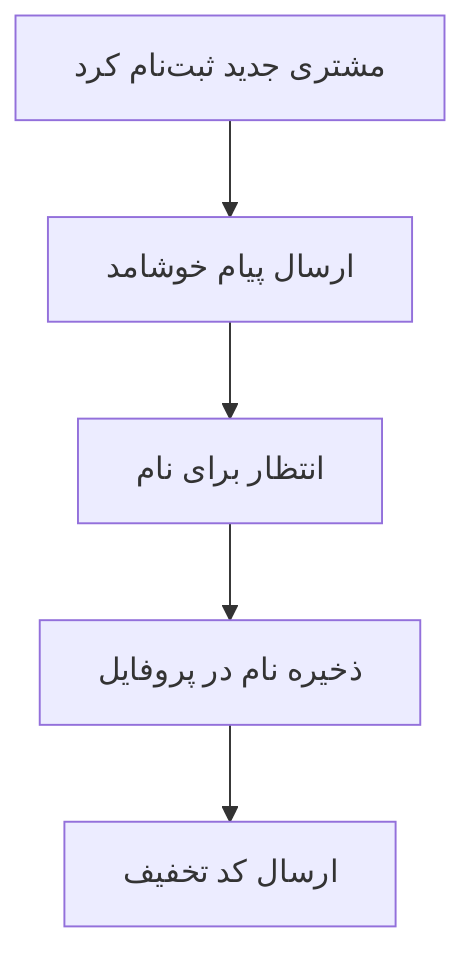
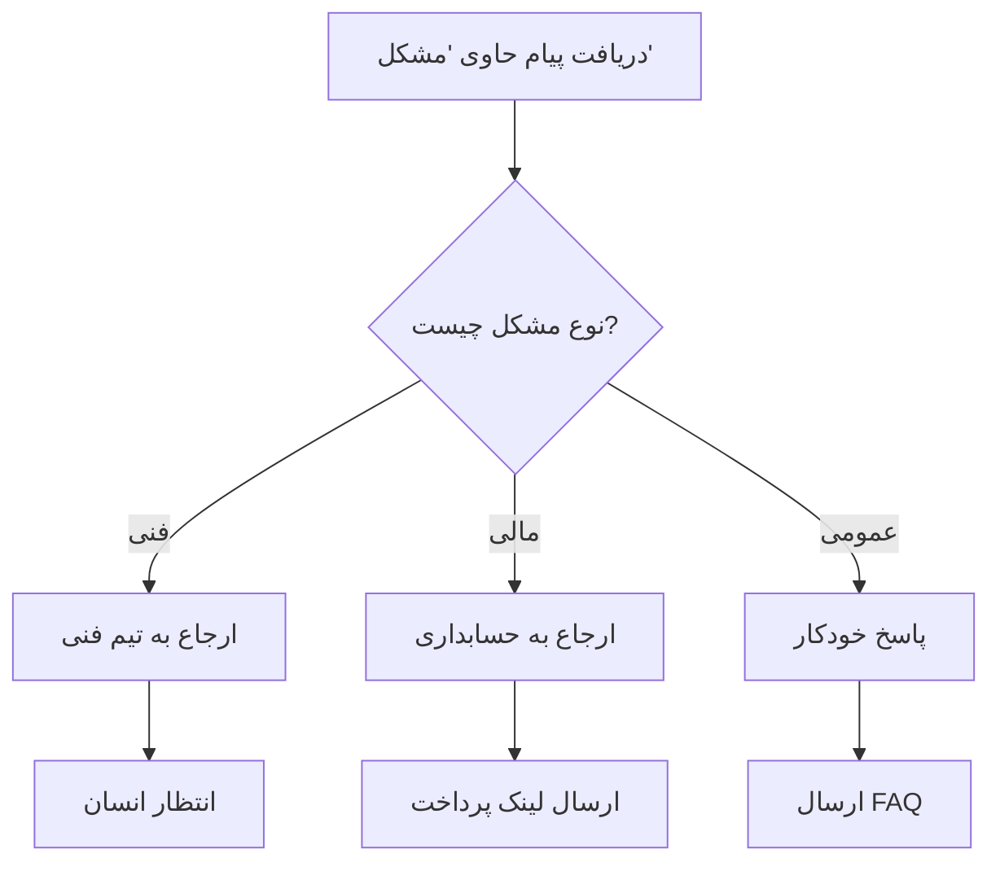
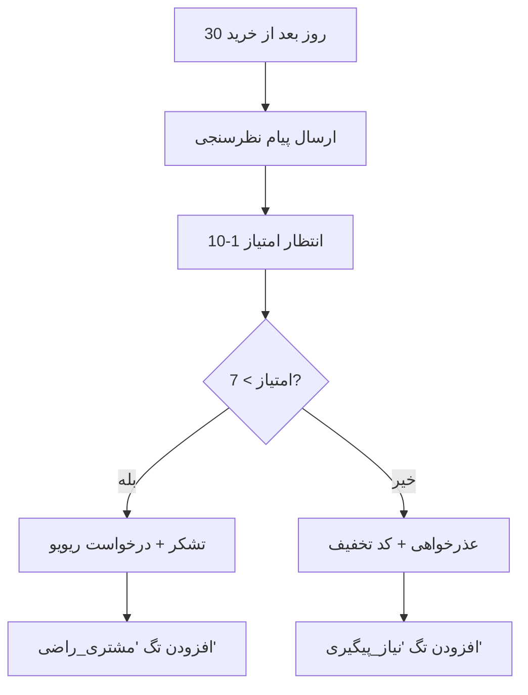
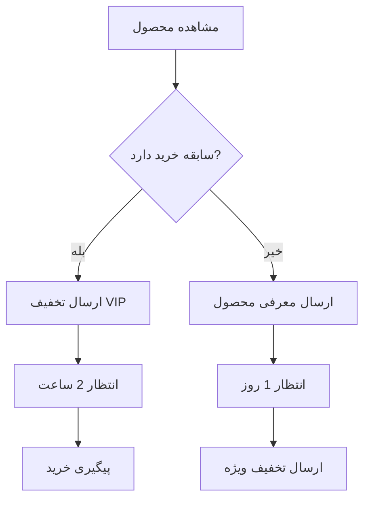

# مستندات کامل سیستم ورک‌فلو (Workflow)

## 📋 فهرست مطالب

1. [معرفی کلی سیستم](#معرفی-کلی-سیستم)
2. [معماری سیستم](#معماری-سیستم)
3. [انواع نودها (Nodes)](#انواع-نودها)
4. [نحوه ایجاد ورک‌فلو](#نحوه-ایجاد-ورک‌فلو)
5. [مثال‌های عملی](#مثال‌های-عملی)
6. [پنل مدیریت](#پنل-مدیریت)
7. [تنظیمات پیشرفته](#تنظیمات-پیشرفته)
8. [عیب‌یابی](#عیب‌یابی)
9. [بهترین شیوه‌ها](#بهترین-شیوه‌ها)
10. [راهنمای کامل API](#راهنمای-کامل-api)
11. [API یکپارچه مدیریت Node ها](#api-یکپارچه-مدیریت-node-ها)
12. [بروزرسانی‌ها](#بروزرسانی‌ها)

---

## 🌟 معرفی کلی سیستم

سیستم ورک‌فلو فیکو یک پلتفرم قدرتمند و هوشمند برای خودکارسازی فرآیندهای ارتباط با مشتریان است. این سیستم بر اساس یک ساختار بصری و نود-محور (Node-Based) طراحی شده که امکان ایجاد فلوچارت‌های پیچیده و تعاملی را فراهم می‌کند.

### ویژگی‌های کلیدی:
- ✅ **ساختار بصری**: طراحی شده بر اساس فیگما دیزاین
- ✅ **4 نوع نود اصلی**: When, Condition, Action, Waiting
- ✅ **هوش مصنوعی**: تصمیم‌گیری بر اساس AI
- ✅ **تعامل دو طرفه**: امکان دریافت پاسخ از کاربران
- ✅ **چند کاناله**: پشتیبانی از تلگرام، اینستاگرام و سایر کانال‌ها
- ✅ **زمان‌بندی**: اجرای خودکار در زمان‌های مشخص
- ✅ **یکپارچگی کامل**: ادغام با سیستم‌های موجود

---

## 🏗️ معماری سیستم

### ساختار کلی

```
┌─────────────────────────────────────────────────────────────┐
│                    سیستم ورک‌فلو فیکو                        │
├─────────────────────────────────────────────────────────────┤
│  ┌─────────────┐  ┌─────────────┐  ┌─────────────┐        │
│  │ When Nodes  │  │ Condition   │  │ Action      │        │
│  │ (شروع‌کننده) │  │ Nodes       │  │ Nodes       │        │
│  │             │  │ (شرط‌ها)     │  │ (عملیات)    │        │
│  └─────────────┘  └─────────────┘  └─────────────┘        │
│                                                             │
│  ┌─────────────┐  ┌─────────────┐  ┌─────────────┐        │
│  │ Waiting     │  │ Node        │  │ User        │        │
│  │ Nodes       │  │ Connections │  │ Responses   │        │
│  │ (انتظار)     │  │ (اتصالات)   │  │ (پاسخ‌ها)    │        │
│  └─────────────┘  └─────────────┘  └─────────────┘        │
└─────────────────────────────────────────────────────────────┘
```

### مدل‌های پایگاه داده

#### مدل اصلی: WorkflowNode
```python
WorkflowNode:
    - id: UUID (شناسه یکتا)
    - workflow: ForeignKey (ورک‌فلو مربوطه)
    - node_type: CharField (نوع نود)
    - title: CharField (عنوان نود)
    - position_x: FloatField (موقعیت افقی)
    - position_y: FloatField (موقعیت عمودی)
    - configuration: JSONField (تنظیمات اضافی)
    - is_active: BooleanField (فعال/غیرفعال)
    - created_at: DateTimeField (تاریخ ایجاد)
    - updated_at: DateTimeField (تاریخ بروزرسانی)
```

---

## 🔗 انواع نودها

### 1. 🟣 When Node (نود شروع‌کننده)

نودهای شروع‌کننده نقطه آغاز هر ورک‌فلو هستند و مشخص می‌کنند که چه رویدادی باعث شروع فرآیند می‌شود.

#### انواع When Node:

##### 📨 **Receive Message** (دریافت پیام)
- **کاربرد**: زمانی که پیام جدیدی از مشتری دریافت می‌شود
- **تنظیمات**:
  ```json
  {
    "when_type": "receive_message",
    "keywords": ["سلام", "کمک", "پشتیبانی"],
    "channels": ["telegram", "instagram", "all"],
    "title": "دریافت پیام جدید"
  }
  ```

##### 🏷️ **Add Tag** (افزودن تگ)
- **کاربرد**: زمانی که تگ جدیدی به مشتری اضافه می‌شود
- **تنظیمات**:
  ```json
  {
    "when_type": "add_tag",
    "tags": ["مشتری_جدید", "علاقه_مند"],
    "title": "تگ جدید اضافه شد"
  }
  ```

##### 👤 **New Customer** (مشتری جدید)
- **کاربرد**: زمانی که مشتری جدیدی ثبت‌نام می‌کند
- **تنظیمات**:
  ```json
  {
    "when_type": "new_customer",
    "title": "مشتری جدید ثبت‌نام کرد"
  }
  ```

##### ⏰ **Scheduled** (زمان‌بندی شده)
- **کاربرد**: اجرای خودکار در زمان‌های مشخص
- **تنظیمات**:
  ```json
  {
    "when_type": "scheduled",
    "schedule_frequency": "daily",
    "schedule_start_date": "2024-01-01",
    "schedule_time": "09:00:00",
    "title": "بررسی روزانه مشتریان"
  }
  ```

#### فرکانس‌های زمان‌بندی:
- **Once** (یکبار): اجرای تک‌باره
- **Daily** (روزانه): هر روز در زمان مشخص
- **Weekly** (هفتگی): هر هفته در روز و زمان مشخص
- **Monthly** (ماهانه): هر ماه در تاریخ مشخص
- **Yearly** (سالانه): هر سال در تاریخ مشخص

---

### 2. 🟢 Condition Node (نود شرطی)

نودهای شرطی مسئول بررسی شرایط مختلف هستند و مسیر ادامه ورک‌فلو را تعیین می‌کنند.

#### ساختار کلی:
```json
{
  "node_type": "condition",
  "title": "عنوان نود",
  "combination_operator": "or",
  "conditions": [...]
}
```

#### عملگرهای ترکیبی (`combination_operator`):
- **AND** (و): تمام شرایط باید برقرار باشند
- **OR** (یا): حداقل یک شرط باید برقرار باشد (پیش‌فرض)

#### انواع شرط‌ها:

##### 🤖 **AI Condition** (شرط هوش مصنوعی)
از هوش مصنوعی برای تحلیل پیام استفاده می‌کند:

```json
{
  "type": "ai",
  "prompt": "آیا این پیام درخواست کمک فنی است؟"
}
```

##### 💬 **Message Condition** (شرط پیام)
محتوای پیام را با عملگرهای مختلف بررسی می‌کند:

```json
{
  "type": "message",
  "operator": "contains",
  "value": "تخفیف"
}
```

**عملگرهای پیام**:
- `equals_to` (=): متن دقیقاً برابر باشد
- `not_equal` (≠): متن برابر نباشد  
- `start_with`: متن با کلمه مشخص شروع شود
- `end_with`: متن با کلمه مشخص تمام شود
- `contains`: متن شامل کلمه مشخص باشد

#### مثال کامل:
```json
{
  "node_type": "condition",
  "title": "بررسی نوع درخواست",
  "combination_operator": "or",
  "conditions": [
    {
      "type": "ai",
      "prompt": "آیا این پیام درخواست پشتیبانی است؟"
    },
    {
      "type": "message",
      "operator": "contains",
      "value": "کمک"
    },
    {
      "type": "message",
      "operator": "start_with",
      "value": "سلام"
    }
  ]
}
```

---

### 3. 🔵 Action Node (نود عملیاتی)

نودهای عملیاتی مسئول اجرای کارهای مختلف هستند.

#### انواع Action کامل:

##### 📤 **Send Message** (ارسال پیام)
```json
{
  "action_type": "send_message",
  "message_content": "سلام {{user.first_name}}! خوش آمدید.",
  "title": "ارسال پیام خوشامد"
}
```

##### ⏱️ **Delay** (تاخیر)
```json
{
  "action_type": "delay",
  "delay_amount": 30,
  "delay_unit": "minutes",
  "title": "انتظار 30 دقیقه"
}
```

**واحدهای زمانی**:
- `seconds` (ثانیه)
- `minutes` (دقیقه) - پیش‌فرض
- `hours` (ساعت)
- `days` (روز)

##### 🔄 **Redirect Conversation** (ارجاع مکالمه)
```json
{
  "action_type": "redirect_conversation",
  "redirect_destination": "support",
  "title": "ارجاع به پشتیبانی"
}
```

**مقاصد ارجاع**:
- `support` (پشتیبانی)
- `sales` (فروش)
- `technical` (فنی)
- `billing` (حسابداری)
- `general` (عمومی)

##### 🏷️ **Add Tag** (اضافه کردن تگ)
```json
{
  "action_type": "add_tag",
  "tag_name": "VIP",
  "title": "اضافه کردن تگ VIP"
}
```

##### 🗑️ **Remove Tag** (حذف تگ)
```json
{
  "action_type": "remove_tag",
  "tag_name": "trial",
  "title": "حذف تگ آزمایشی"
}
```

##### 👤 **Transfer to Human** (انتقال به انسان)
```json
{
  "action_type": "transfer_to_human",
  "title": "انتقال به اپراتور انسانی"
}
```

##### 📧 **Send Email** (ارسال ایمیل)
```json
{
  "action_type": "send_email",
  "title": "ارسال ایمیل پیگیری"
}
```

##### 🔗 **Webhook** (فراخوانی API خارجی)
```json
{
  "action_type": "webhook",
  "webhook_url": "https://api.example.com/notify",
  "webhook_method": "POST",
  "webhook_headers": {"Authorization": "Bearer token"},
  "webhook_payload": {"user_id": "{{user.id}}", "event": "workflow_action"},
  "title": "فراخوانی API خارجی"
}
```

**روش‌های HTTP پشتیبانی شده**:
- `GET`
- `POST` (پیش‌فرض)
- `PUT`
- `DELETE`

##### 💻 **Custom Code** (کد سفارشی)
```json
{
  "action_type": "custom_code",
  "custom_code": "# محاسبه امتیاز مشتری\nuser_orders = context.get('user', {}).get('total_orders', 0)\nif user_orders > 10:\n    context['user']['tier'] = 'VIP'\nelse:\n    context['user']['tier'] = 'Standard'",
  "title": "محاسبه سطح مشتری"
}
```
```json
{
  "action_type": "add_tag",
  "tag_name": "مشتری_فعال",
  "title": "افزودن تگ مشتری فعال"
}
```

##### 👤 **Transfer to Human** (انتقال به انسان)
```json
{
  "action_type": "transfer_to_human",
  "title": "انتقال به اپراتور انسانی"
}
```

##### 🔗 **Webhook** (فراخوانی API)
```json
{
  "action_type": "webhook",
  "webhook_url": "https://api.example.com/notify",
  "webhook_method": "POST",
  "webhook_headers": {"Content-Type": "application/json"},
  "webhook_payload": {"customer_id": "{{user.id}}"},
  "title": "اطلاع‌رسانی به سیستم خارجی"
}
```

##### 💻 **Custom Code** (کد سفارشی)
```json
{
  "action_type": "custom_code",
  "custom_code": "# کد پایتون سفارشی\nresult['calculated_value'] = context['user']['age'] * 2",
  "title": "محاسبه سفارشی"
}
```

---

### 4. 🟠 Waiting Node (نود انتظار)

نودهای انتظار مسئول تعامل با کاربر و دریافت پاسخ از آن‌ها هستند.

#### انواع پاسخ (`answer_type`):

##### 📝 **Text Answer** (پاسخ متنی)
```json
{
  "answer_type": "text",
  "customer_message": "لطفاً نام خود را وارد کنید:",
  "storage_type": "user_profile",
  "storage_field": "first_name"
}
```

##### 🔢 **Number Answer** (پاسخ عددی)
```json
{
  "answer_type": "number",
  "customer_message": "چند سال سن دارید؟",
  "storage_type": "user_profile",
  "storage_field": "age"
}
```

##### 📧 **Email Answer** (پاسخ ایمیل)
```json
{
  "answer_type": "email", 
  "customer_message": "لطفاً آدرس ایمیل خود را وارد کنید:",
  "storage_type": "database",
  "storage_field": "email_address"
}
```

##### 📞 **Phone Answer** (پاسخ تلفن)
```json
{
  "answer_type": "phone",
  "customer_message": "شماره تماس خود را وارد کنید:",
  "storage_type": "custom_field",
  "storage_field": "phone_number"
}
```

##### 📅 **Date Answer** (پاسخ تاریخ)
```json
{
  "answer_type": "date",
  "customer_message": "تاریخ تولد خود را وارد کنید:",
  "storage_type": "user_profile",
  "storage_field": "birth_date"
}
```

##### ☑️ **Choice Answer** (پاسخ چندگزینه‌ای)
```json
{
  "answer_type": "choice",
  "customer_message": "نوع پشتیبانی مورد نیاز خود را انتخاب کنید:",
  "choice_options": ["فنی", "فروش", "حسابداری", "عمومی"],
  "storage_type": "session",
  "storage_field": "support_type"
}
```

#### انواع ذخیره‌سازی (`storage_type`):

- **`user_profile`**: ذخیره در پروفایل کاربر
- **`custom_field`**: ذخیره در فیلد سفارشی
- **`database`**: ذخیره در جدول دیتابیس
- **`session`**: ذخیره در جلسه (Session)
- **`temporary`**: ذخیره موقت

#### محدودیت زمانی پاسخ:

```json
{
  "response_time_limit_enabled": true,
  "response_timeout_amount": 30,
  "response_timeout_unit": "minutes"
}
```

**واحدهای زمانی**:
- `seconds` (ثانیه)
- `minutes` (دقیقه)
- `hours` (ساعت) 
- `days` (روز)

#### تنظیمات اعتبارسنجی:

```json
{
  "allowed_errors": 3,
  "skip_keywords": ["رد", "بعدا", "skip"],
  "customer_message": "پیام ارسالی به کاربر"
}
```

#### مثال کامل:

```json
{
  "node_type": "waiting",
  "title": "دریافت اطلاعات تماس",
  "answer_type": "email",
  "storage_type": "user_profile",
  "storage_field": "email",
  "customer_message": "لطفاً آدرس ایمیل خود را برای ارسال اطلاعات تکمیلی وارد کنید:",
  "response_time_limit_enabled": true,
  "response_timeout_amount": 5,
  "response_timeout_unit": "minutes",
  "allowed_errors": 2,
  "skip_keywords": ["بعدا", "رد", "skip"],
  "position_x": 400,
  "position_y": 300
}
  "storage_field": "first_name"
}
```

##### 🔢 **Number** (عدد)
```json
{
  "answer_type": "number",
  "customer_message": "سن خود را وارد کنید:",
  "storage_type": "customer_data",
  "storage_field": "age"
}
```

##### 📧 **Email** (ایمیل)
```json
{
  "answer_type": "email",
  "customer_message": "ایمیل خود را وارد کنید:",
  "storage_type": "customer_data",
  "storage_field": "email"
}
```

##### 📱 **Phone** (تلفن)
```json
{
  "answer_type": "phone",
  "customer_message": "شماره تماس خود را وارد کنید:",
  "storage_type": "customer_data",
  "storage_field": "phone"
}
```

##### 📅 **Date** (تاریخ)
```json
{
  "answer_type": "date",
  "customer_message": "تاریخ تولد خود را وارد کنید (YYYY-MM-DD):",
  "storage_type": "customer_data",
  "storage_field": "birth_date"
}
```

##### ☑️ **Choice** (انتخابی)
```json
{
  "answer_type": "choice",
  "customer_message": "محصول مورد علاقه خود را انتخاب کنید:",
  "choice_options": ["لپ‌تاپ", "موبایل", "تبلت"],
  "storage_type": "temporary"
}
```

#### تنظیمات اعتبارسنجی:
- **allowed_errors**: تعداد خطاهای مجاز (پیش‌فرض: 3)
- **skip_keywords**: کلمات رد کردن مرحله (مثل: ["رد", "بعداً"])
- **response_timeout**: زمان انتظار به ثانیه (پیش‌فرض: 3600)

#### انواع ذخیره‌سازی:
- **temporary**: ذخیره موقت در context اجرا
- **customer_data**: ذخیره در پروفایل مشتری

---

## 🔌 API های موجود

### Base URL
```
/api/v1/workflow/api/
```

### 1. مدیریت ورک‌فلوهای نود-محور

#### لیست ورک‌فلوها
```http
GET /node-workflows/
```

**پاسخ نمونه:**
```json
{
  "count": 5,
  "results": [
    {
      "id": "uuid-here",
      "name": "خوشامدگویی به مشتریان جدید",
      "description": "فرآیند خودکار خوشامدگویی",
      "status": "ACTIVE",
      "nodes_count": 4,
      "created_at": "2024-01-01T10:00:00Z"
    }
  ]
}
```

#### ایجاد ورک‌فلو جدید
```http
POST /node-workflows/
Content-Type: application/json

{
  "name": "پیگیری مشتریان",
  "description": "پیگیری خودکار مشتریان غیرفعال",
  "status": "DRAFT"
}
```

#### جزئیات ورک‌فلو
```http
GET /node-workflows/{workflow_id}/
```

**پاسخ شامل:**
- اطلاعات کلی ورک‌فلو
- تمام نودها
- اتصالات بین نودها
- آخرین اجراها

### 2. مدیریت نودها

#### دریافت نودهای ورک‌فلو
```http
GET /node-workflows/{workflow_id}/nodes/
```

#### ایجاد نود جدید
```http
POST /node-workflows/{workflow_id}/create_node/
Content-Type: application/json
```

**نمونه ایجاد When Node:**
```json
{
  "node_type": "when",
  "title": "دریافت پیام کمک",
  "when_type": "receive_message",
  "keywords": ["کمک", "پشتیبانی", "سوال"],
  "channels": ["telegram", "instagram"],
  "position_x": 100,
  "position_y": 200
}
```

**نمونه ایجاد Condition Node:**
```json
{
  "node_type": "condition",
  "title": "بررسی نوع درخواست",
  "combination_operator": "or",
  "conditions": [
    {
      "type": "ai",
      "prompt": "آیا این پیام درخواست کمک فنی است؟"
    },
    {
      "type": "message",
      "operator": "contains",
      "value": "خرابی"
    },
    {
      "type": "message",
      "operator": "start_with",
      "value": "سلام"
    }
  ],
  "position_x": 300,
  "position_y": 200
}
```

**نمونه ایجاد Action Node:**
```json
{
  "node_type": "action",
  "title": "ارسال پیام راهنما",
  "action_type": "send_message",
  "message_content": "سلام {{user.first_name}}! چطور می‌تونم کمکتان کنم؟",
  "position_x": 500,
  "position_y": 200
}
```

**نمونه ایجاد Waiting Node:**
```json
{
  "node_type": "waiting",
  "title": "دریافت شماره تماس",
  "answer_type": "phone",
  "storage_type": "customer_data",
  "storage_field": "phone",
  "customer_message": "لطفاً شماره تماس خود را برای پیگیری وارد کنید:",
  "allowed_errors": 3,
  "response_timeout": 1800,
  "position_x": 700,
  "position_y": 200
}
```

### 3. مدیریت اتصالات

#### دریافت اتصالات
```http
GET /node-workflows/{workflow_id}/connections/
```

#### ایجاد اتصال جدید
```http
POST /node-workflows/{workflow_id}/create_connection/
Content-Type: application/json

{
  "source_node_id": "uuid-source",
  "target_node_id": "uuid-target",
  "connection_type": "success"
}
```

**انواع اتصال:**
- `success`: در صورت موفقیت
- `failure`: در صورت شکست
- `timeout`: در صورت timeout
- `skip`: برای رد کردن

### 4. اجرای ورک‌فلو

#### اجرای دستی
```http
POST /node-workflows/{workflow_id}/execute_with_nodes/
Content-Type: application/json

{
  "context": {
    "event": {
      "type": "MESSAGE_RECEIVED",
      "data": {
        "content": "سلام، کمک می‌خواهم",
        "message_id": "msg123"
      },
      "user_id": "customer123",
      "conversation_id": "conv123"
    },
    "user": {
      "first_name": "احمد",
      "source": "telegram"
    }
  }
}
```

### 5. مدیریت نودهای مختلف

#### When Nodes
```http
GET /when-nodes/
POST /when-nodes/
GET /when-nodes/{id}/
PUT /when-nodes/{id}/
DELETE /when-nodes/{id}/
GET /when-nodes/when_types/  # دریافت انواع when
```

#### Condition Nodes
```http
GET /condition-nodes/
POST /condition-nodes/
GET /condition-nodes/{id}/
PUT /condition-nodes/{id}/
DELETE /condition-nodes/{id}/
POST /condition-nodes/{id}/test/  # تست شرط
```

#### Action Nodes
```http
GET /action-nodes/
POST /action-nodes/
GET /action-nodes/{id}/
PUT /action-nodes/{id}/
DELETE /action-nodes/{id}/
GET /action-nodes/action_types/  # انواع action
GET /action-nodes/redirect_destinations/  # مقاصد ارجاع
```

#### Waiting Nodes
```http
GET /waiting-nodes/
POST /waiting-nodes/
GET /waiting-nodes/{id}/
PUT /waiting-nodes/{id}/
DELETE /waiting-nodes/{id}/
GET /waiting-nodes/answer_types/  # انواع پاسخ
GET /waiting-nodes/{id}/responses/  # پاسخ‌های کاربران
```

#### User Responses
```http
GET /user-responses/  # مشاهده پاسخ‌های کاربران
```

---

## 🛠️ نحوه ایجاد ورک‌فلو

### مرحله 1: ایجاد ورک‌فلو پایه

```bash
curl -X POST http://localhost:8000/api/v1/workflow/api/node-workflows/ \
  -H "Content-Type: application/json" \
  -H "Authorization: Bearer YOUR_TOKEN" \
  -d '{
    "name": "پاسخگویی خودکار",
    "description": "پاسخگویی هوشمند به سوالات مشتریان",
    "status": "DRAFT"
  }'
```

### مرحله 2: اضافه کردن نود شروع

```bash
curl -X POST http://localhost:8000/api/v1/workflow/api/node-workflows/WORKFLOW_ID/create_node/ \
  -H "Content-Type: application/json" \
  -H "Authorization: Bearer YOUR_TOKEN" \
  -d '{
    "node_type": "when",
    "title": "دریافت پیام",
    "when_type": "receive_message",
    "keywords": ["سلام", "کمک"],
    "channels": ["all"],
    "position_x": 50,
    "position_y": 100
  }'
```

### مرحله 3: اضافه کردن نود شرطی

```bash
curl -X POST http://localhost:8000/api/v1/workflow/api/node-workflows/WORKFLOW_ID/create_node/ \
  -H "Content-Type: application/json" \
  -H "Authorization: Bearer YOUR_TOKEN" \
  -d '{
    "node_type": "condition",
    "title": "نوع سوال",
    "operator": "or",
    "conditions": [
      {
        "type": "ai",
        "ai_prompt": "آیا این سوال درباره قیمت محصولات است؟"
      }
    ],
    "position_x": 250,
    "position_y": 100
  }'
```

### مرحله 4: اضافه کردن نود عملیاتی

```bash
curl -X POST http://localhost:8000/api/v1/workflow/api/node-workflows/WORKFLOW_ID/create_node/ \
  -H "Content-Type: application/json" \
  -H "Authorization: Bearer YOUR_TOKEN" \
  -d '{
    "node_type": "action",
    "title": "ارسال لیست قیمت",
    "action_type": "send_message",
    "message_content": "لیست قیمت‌های ما:\n- لپ‌تاپ: 20 میلیون\n- موبایل: 8 میلیون",
    "position_x": 450,
    "position_y": 100
  }'
```

### مرحله 5: اتصال نودها

```bash
curl -X POST http://localhost:8000/api/v1/workflow/api/node-workflows/WORKFLOW_ID/create_connection/ \
  -H "Content-Type: application/json" \
  -H "Authorization: Bearer YOUR_TOKEN" \
  -d '{
    "source_node_id": "WHEN_NODE_ID",
    "target_node_id": "CONDITION_NODE_ID",
    "connection_type": "success"
  }'
```

### مرحله 6: فعال‌سازی ورک‌فلو

```bash
curl -X PUT http://localhost:8000/api/v1/workflow/api/node-workflows/WORKFLOW_ID/ \
  -H "Content-Type: application/json" \
  -H "Authorization: Bearer YOUR_TOKEN" \
  -d '{
    "status": "ACTIVE"
  }'
```

---

## 📖 مثال‌های عملی

### مثال 1: خوشامدگویی به مشتریان جدید



**مراحل پیاده‌سازی:**

1. **When Node**: New Customer
2. **Action Node**: Send Message "سلام! به فروشگاه ما خوش آمدید"
3. **Waiting Node**: دریافت نام (Text input)
4. **Action Node**: Add Tag "نام_دریافت_شده"
5. **Action Node**: Send Message "کد تخفیف شما: WELCOME20"

### مثال 2: پشتیبانی هوشمند



**تنظیمات AI Condition:**
```json
{
  "type": "ai",
  "ai_prompt": "این پیام درباره چه نوع مشکلی است؟ فنی، مالی یا عمومی؟"
}
```

### مثال 3: نظرسنجی رضایت



### مثال 4: بازاریابی شخصی‌سازی شده



---

## ⚙️ پنل مدیریت

### دسترسی به پنل ادمین

```
URL: /admin/
```

### بخش‌های مرتبط با ورک‌فلو:

#### 1. Workflow Node
- مشاهده و مدیریت همه نودها
- فیلتر بر اساس نوع نود
- ویرایش موقعیت نودها

#### 2. When Nodes
- مدیریت نودهای شروع‌کننده
- تنظیم کلمات کلیدی
- مدیریت زمان‌بندی

#### 3. Condition Nodes
- تنظیم شرایط
- مدیریت prompts هوش مصنوعی
- تست شرایط

#### 4. Action Nodes
- تنظیم عملیات
- مدیریت پیام‌ها
- تنظیم webhooks

#### 5. Waiting Nodes
- تنظیم انتظار پاسخ
- مدیریت نوع پاسخ‌ها
- تنظیم اعتبارسنجی

#### 6. Node Connections
- مشاهده اتصالات
- مدیریت نوع اتصال
- تنظیم شرایط اتصال

#### 7. User Responses
- مشاهده پاسخ‌های کاربران
- بررسی validity پاسخ‌ها
- آمار تعامل

#### 8. Workflow Executions
- لیست اجراهای ورک‌فلو
- وضعیت اجراها
- لاگ خطاها

---

## 🎯 تنظیمات پیشرفته

### 1. متغیرهای Template

در تمام بخش‌های متنی می‌توانید از متغیرهای زیر استفاده کنید:

#### متغیرهای کاربر:
- `{{user.first_name}}` - نام
- `{{user.last_name}}` - نام خانوادگی
- `{{user.email}}` - ایمیل
- `{{user.phone}}` - شماره تلفن
- `{{user.source}}` - منبع (telegram/instagram)
- `{{user.source_id}}` - شناسه منبع
- `{{user.created_at}}` - تاریخ ثبت‌نام

#### متغیرهای رویداد:
- `{{event.type}}` - نوع رویداد
- `{{event.data.content}}` - محتوای پیام
- `{{event.data.message_id}}` - شناسه پیام
- `{{event.timestamp}}` - زمان رویداد
- `{{event.user_id}}` - شناسه کاربر
- `{{event.conversation_id}}` - شناسه مکالمه

#### متغیرهای پاسخ قبلی:
- `{{user_response_NODE_ID}}` - پاسخ کاربر به نود مشخص

#### متغیرهای زمان:
- `{{now}}` - زمان فعلی
- `{{today}}` - تاریخ امروز

### 2. تنظیمات AI

برای بهینه‌سازی عملکرد AI در condition ها:

#### نکات مهم:
- از جملات واضح و مشخص استفاده کنید
- سوالات را به صورت yes/no طرح کنید
- از مثال‌های مشخص استفاده کنید

#### مثال‌های خوب:
```
✅ "آیا این پیام درخواست لغو سفارش است؟"
✅ "آیا کاربر ناراضی به نظر می‌رسد؟"
✅ "آیا این پیام شامل شماره تلفن است؟"
```

#### مثال‌های ضعیف:
```
❌ "این پیام چه موضوعی دارد؟"
❌ "کاربر چطور احساس می‌کند؟"
❌ "این پیام چند کلمه دارد؟"
```

### 3. تنظیمات Webhook

#### headers مفید:
```json
{
  "Content-Type": "application/json",
  "Authorization": "Bearer YOUR_TOKEN",
  "User-Agent": "Fiko-Workflow/1.0"
}
```

#### payload نمونه:
```json
{
  "customer_id": "{{user.id}}",
  "event_type": "{{event.type}}",
  "message": "{{event.data.content}}",
  "timestamp": "{{event.timestamp}}",
  "workflow_id": "{{workflow.id}}",
  "node_id": "{{node.id}}"
}
```

### 4. اعتبارسنجی پیشرفته

#### Regex patterns مفید:

**شماره تلفن ایرانی:**
```
^(\+98|0)?9\d{9}$
```

**کد ملی:**
```
^\d{10}$
```

**شماره کارت:**
```
^\d{16}$
```

**کد پستی:**
```
^\d{10}$
```

### 5. بهینه‌سازی عملکرد

#### تنظیمات Timeout:
- **پیام‌های ساده**: 30 ثانیه
- **فرم‌های کوتاه**: 5 دقیقه (300 ثانیه)
- **فرم‌های پیچیده**: 30 دقیقه (1800 ثانیه)
- **نظرسنجی**: 1 ساعت (3600 ثانیه)

#### تعداد خطاهای مجاز:
- **ورودی ساده**: 3 بار
- **ورودی پیچیده**: 5 بار
- **اطلاعات مهم**: 1 بار

---

## 🔍 عیب‌یابی

### مشکلات رایج و راه‌حل‌ها

#### 1. ورک‌فلو اجرا نمی‌شود

**علل احتمالی:**
- وضعیت ورک‌فلو `ACTIVE` نیست
- نود When تنظیم نشده
- کلمات کلیدی match نمی‌کنند

**راه‌حل:**
```bash
# بررسی وضعیت ورک‌فلو
GET /api/v1/workflow/api/node-workflows/{id}/

# بررسی نودهای When
GET /api/v1/workflow/api/when-nodes/?workflow={id}

# بررسی لاگ‌ها
GET /api/v1/workflow/api/trigger-event-logs/
```

#### 2. شرایط درست evaluate نمی‌شوند

**علل احتمالی:**
- field path اشتباه است
- نوع داده مطابقت ندارد
- AI prompt مبهم است

**راه‌حل:**
```bash
# تست شرط
POST /api/v1/workflow/api/condition-nodes/{id}/test/
{
  "context": {
    "event": {...},
    "user": {...}
  }
}
```

#### 3. Action اجرا نمی‌شود

**علل احتمالی:**
- Template variables اشتباه
- API خارجی در دسترس نیست
- اطلاعات کاربر ناقص

**راه‌حل:**
```bash
# بررسی اجراهای action
GET /api/v1/workflow/api/workflow-action-executions/?workflow_execution={id}

# بررسی لاگ خطاها
GET /api/v1/workflow/api/action-logs/?success=false
```

#### 4. Waiting Node پاسخ دریافت نمی‌کند

**علل احتمالی:**
- validation rules سخت‌گیرانه
- timeout کم
- پیام راهنما واضح نیست

**راه‌حل:**
```bash
# بررسی پاسخ‌های کاربر
GET /api/v1/workflow/api/waiting-nodes/{id}/responses/

# بررسی پاسخ‌های invalid
GET /api/v1/workflow/api/user-responses/?is_valid=false
```

### 5. مشکلات عملکرد

#### Timeout های طولانی:
```python
# تنظیم در settings
WORKFLOW_EXECUTION_TIMEOUT = 300  # 5 دقیقه
WORKFLOW_ACTION_TIMEOUT = 60     # 1 دقیقه
```

#### Memory Usage بالا:
```python
# محدود کردن context size
MAX_CONTEXT_SIZE = 1024 * 1024  # 1MB
```

---

## 📊 مونیتورینگ و آمار

### 1. Dashboard آمار

#### متریک‌های کلیدی:
- تعداد ورک‌فلوهای فعال
- تعداد اجراهای روزانه
- نرخ موفقیت
- میانگین زمان اجرا
- تعداد خطاها

#### API آمار:
```bash
GET /api/v1/workflow/api/workflows/statistics/
```

**پاسخ نمونه:**
```json
{
  "total_workflows": 25,
  "active_workflows": 18,
  "today_executions": 1250,
  "success_rate": 94.5,
  "average_duration": 5.2,
  "error_count": 12
}
```

### 2. لاگ‌گیری

#### انواع لاگ:
- **Execution Logs**: اجرای ورک‌فلو
- **Action Logs**: اجرای actions
- **Error Logs**: خطاها
- **Performance Logs**: عملکرد

#### تنظیم سطح لاگ:
```python
# در settings.py
LOGGING = {
    'loggers': {
        'workflow': {
            'level': 'INFO',  # DEBUG, INFO, WARNING, ERROR
            'handlers': ['console', 'file'],
        }
    }
}
```

### 3. آلارم‌ها

#### شرایط آلارم:
- نرخ خطا بالاتر از 5%
- زمان پاسخ بالاتر از 10 ثانیه
- تعداد اجراهای ناموفق متوالی

---

## 🎯 بهترین شیوه‌ها

### 1. طراحی ورک‌فلو

#### اصول کلی:
- **سادگی**: ورک‌فلوها را ساده نگه دارید
- **وضوح**: عناوین واضح انتخاب کنید
- **تست**: همیشه قبل از فعال‌سازی تست کنید
- **مستندسازی**: هر ورک‌فلو را مستند کنید

#### ساختار پیشنهادی:
```
1. نود شروع (When)
2. اعتبارسنجی اولیه (Condition)
3. عملیات اصلی (Action)
4. تعامل با کاربر (Waiting) - اختیاری
5. پردازش پاسخ (Action)
6. عملیات نهایی (Action)
```

### 2. پیام‌نویسی

#### اصول مهم:
- **زبان ساده**: از کلمات ساده استفاده کنید
- **مثبت بودن**: لحن مثبت داشته باشید
- **شخصی‌سازی**: از نام کاربر استفاده کنید
- **واضح بودن**: دستورات واضح بدهید

#### مثال‌های خوب:
```
✅ "سلام {{user.first_name}}! چطور می‌تونم کمکتان کنم؟"
✅ "لطفاً شماره سفارش خود را وارد کنید:"
✅ "ممنون از صبر شما. موضوع شما به تیم فنی ارجاع داده شد."
```

#### مثال‌های ضعیف:
```
❌ "شماره سفارش؟"
❌ "خطا در سیستم"
❌ "منتظر بمانید"
```

### 3. مدیریت خطا

#### پیش‌گیری از خطا:
- validation در سمت کلاینت
- پیام‌های راهنما واضح
- مثال‌های عملی

#### مدیریت خطا:
- پیام‌های خطای دوستانه
- ارائه راه‌حل جایگزین
- امکان تماس با پشتیبانی

### 4. بهینه‌سازی

#### عملکرد:
- محدود کردن تعداد نودها
- استفاده از timeout مناسب
- کش کردن نتایج تکراری

#### قابلیت نگهداری:
- نام‌گذاری منطقی
- گروه‌بندی ورک‌فلوها
- حذف ورک‌فلوهای غیرفعال

### 5. امنیت

#### محافظت از داده‌ها:
- رمزنگاری اطلاعات حساس
- محدود کردن دسترسی API
- لاگ عدم افشای اطلاعات

#### کد امن:
- validation ورودی‌ها
- اجرای امن custom code
- محدود کردن webhook destinations

---

## 📚 منابع اضافی

### 1. مستندات فنی
- [Django REST Framework](https://www.django-rest-framework.org/)
- [Celery Documentation](https://docs.celeryproject.org/)
- [PostgreSQL JSON](https://www.postgresql.org/docs/current/datatype-json.html)

### 2. نمونه کدها
- [GitHub Repository](https://github.com/your-repo/workflow-examples)
- [Postman Collection](https://documenter.getpostman.com/view/...)

### 3. Community
- [Fiko Developers Forum](https://forum.pilito.com/)
- [Telegram Channel](https://t.me/fiko_developers)

---

## 🌐 راهنمای کامل API

### آدرس پایه و احراز هویت

```
Base URL: http://localhost:8000/api/v1/workflow/api/
Authentication: Bearer Token Required
```

### API های اصلی سیستم

#### 1. مدیریت Workflow

```bash
# دریافت لیست ورک‌فلوها
GET /workflows/

# دریافت جزئیات ورک‌فلو (شامل nodes و connections)
GET /workflows/{id}/

# ایجاد ورک‌فلو جدید
POST /workflows/

# بروزرسانی ورک‌فلو
PUT /workflows/{id}/

# فعال‌سازی ورک‌فلو
POST /workflows/{id}/activate/

# غیرفعال‌سازی ورک‌فلو
POST /workflows/{id}/pause/
```

#### 2. مدیریت When Node

```bash
# لیست تمامی When Node ها
GET /when-nodes/

# ایجاد When Node جدید
POST /when-nodes/

# دریافت انواع When Type
GET /when-nodes/when_types/

# نمونه ایجاد When Node
POST /node-workflows/{id}/create_node/
{
  "node_type": "when",
  "title": "دریافت پیام جدید",
  "when_type": "receive_message",
  "keywords": ["سلام", "کمک"],
  "channels": ["telegram", "instagram"],
  "position_x": 100,
  "position_y": 200
}
```

#### 3. مدیریت Condition Node

```bash
# لیست تمامی Condition Node ها
GET /condition-nodes/

# دریافت انواع شرط‌ها
GET /condition-nodes/condition_types/

# دریافت عملگرهای پیام
GET /condition-nodes/message_operators/

# دریافت عملگرهای ترکیبی
GET /condition-nodes/combination_operators/

# تست شرط
POST /condition-nodes/{id}/test/

# نمونه ایجاد Condition Node
POST /node-workflows/{id}/create_node/
{
  "node_type": "condition",
  "title": "بررسی نوع درخواست",
  "combination_operator": "or",
  "conditions": [
    {
      "type": "ai",
      "prompt": "آیا این پیام درخواست پشتیبانی فنی است؟"
    },
    {
      "type": "message",
      "operator": "contains",
      "value": "مشکل فنی"
    }
  ],
  "position_x": 300,
  "position_y": 200
}
```

#### 4. مدیریت Action Node

```bash
# لیست تمامی Action Node ها
GET /action-nodes/

# دریافت انواع Action
GET /action-nodes/action_types/

# دریافت مقاصد Redirect
GET /action-nodes/redirect_destinations/

# دریافت واحدهای زمانی Delay
GET /action-nodes/delay_units/

# دریافت متدهای Webhook
GET /action-nodes/webhook_methods/

# نمونه ایجاد Action Node
POST /node-workflows/{id}/create_node/
{
  "node_type": "action",
  "title": "ارسال پیام پاسخ",
  "action_type": "send_message",
  "message_content": "با تشکر از تماس شما، به زودی پاسخ خواهید گرفت.",
  "position_x": 500,
  "position_y": 200
}
```

#### 5. مدیریت Waiting Node

```bash
# لیست تمامی Waiting Node ها
GET /waiting-nodes/

# دریافت انواع پاسخ
GET /waiting-nodes/answer_types/

# دریافت انواع ذخیره‌سازی
GET /waiting-nodes/storage_types/

# دریافت واحدهای زمانی
GET /waiting-nodes/time_units/

# دریافت پاسخ‌های کاربر
GET /waiting-nodes/{id}/responses/

# نمونه ایجاد Waiting Node
POST /node-workflows/{id}/create_node/
{
  "node_type": "waiting",
  "title": "دریافت ایمیل مشتری",
  "answer_type": "email",
  "storage_type": "user_profile",
  "storage_field": "email",
  "customer_message": "لطفاً آدرس ایمیل خود را وارد کنید:",
  "response_time_limit_enabled": true,
  "response_timeout_amount": 10,
  "response_timeout_unit": "minutes",
  "allowed_errors": 3,
  "skip_keywords": ["رد", "بعداً"],
  "position_x": 700,
  "position_y": 200
}
```

#### 6. مدیریت Connection ها

```bash
# لیست تمامی Connection ها
GET /node-connections/

# ایجاد Connection جدید
POST /node-connections/

# دریافت انواع Connection
GET /node-connections/connection_types/

# نمونه ایجاد Connection
POST /node-workflows/{id}/create_connection/
{
  "source_node": "source-node-uuid",
  "target_node": "target-node-uuid",
  "connection_type": "success"
}
```

### مثال کامل: ایجاد ورک‌فلو با API

```bash
#!/bin/bash

TOKEN="YOUR_JWT_TOKEN"
BASE_URL="http://localhost:8000/api/v1/workflow/api"

# 1. ایجاد ورک‌فلو
WORKFLOW_ID=$(curl -s -X POST \
  -H "Authorization: Bearer $TOKEN" \
  -H "Content-Type: application/json" \
  -d '{
    "name": "خوشامدگویی به مشتریان جدید",
    "description": "ارسال پیام خوشامد و دریافت اطلاعات",
    "status": "DRAFT"
  }' \
  "$BASE_URL/workflows/" | jq -r '.id')

# 2. ایجاد When Node
WHEN_NODE_ID=$(curl -s -X POST \
  -H "Authorization: Bearer $TOKEN" \
  -H "Content-Type: application/json" \
  -d '{
    "node_type": "when",
    "title": "مشتری جدید",
    "when_type": "new_customer",
    "position_x": 100,
    "position_y": 200
  }' \
  "$BASE_URL/node-workflows/$WORKFLOW_ID/create_node/" | jq -r '.id')

# 3. ایجاد Action Node
ACTION_NODE_ID=$(curl -s -X POST \
  -H "Authorization: Bearer $TOKEN" \
  -H "Content-Type: application/json" \
  -d '{
    "node_type": "action",
    "title": "پیام خوشامد",
    "action_type": "send_message",
    "message_content": "سلام! به فروشگاه ما خوش آمدید 🎉",
    "position_x": 300,
    "position_y": 200
  }' \
  "$BASE_URL/node-workflows/$WORKFLOW_ID/create_node/" | jq -r '.id')

# 4. ایجاد Connection
curl -X POST \
  -H "Authorization: Bearer $TOKEN" \
  -H "Content-Type: application/json" \
  -d "{
    \"source_node\": \"$WHEN_NODE_ID\",
    \"target_node\": \"$ACTION_NODE_ID\",
    \"connection_type\": \"success\"
  }" \
  "$BASE_URL/node-workflows/$WORKFLOW_ID/create_connection/"

# 5. فعال‌سازی ورک‌فلو
curl -X POST \
  -H "Authorization: Bearer $TOKEN" \
  "$BASE_URL/workflows/$WORKFLOW_ID/activate/"

echo "ورک‌فلو با موفقیت ایجاد و فعال شد!"
```

### Response Structure جدید GET /workflows/{id}/

```json
{
  "id": "workflow-uuid",
  "name": "خوشامدگویی به مشتریان جدید",
  "description": "ارسال پیام خوشامد و دریافت اطلاعات",
  "status": "ACTIVE",
  
  // اطلاعات legacy
  "actions": [...],
  "triggers": [...],
  "recent_executions": [...],
  
  // اطلاعات جدید node-based
  "nodes": [
    {
      "id": "when-node-uuid",
      "node_type": "when",
      "title": "مشتری جدید",
      "when_type": "new_customer",
      // ... سایر فیلدها
    },
    {
      "id": "action-node-uuid",
      "node_type": "action",
      "title": "پیام خوشامد",
      "action_type": "send_message",
      // ... سایر فیلدها
    }
  ],
  
  "connections": [
    {
      "id": "connection-uuid",
      "source_node": "when-node-uuid",
      "target_node": "action-node-uuid",
      "connection_type": "success",
      // ... سایر فیلدها
    }
  ],
  
  "node_summary": {
    "total_nodes": 2,
    "when_nodes": 1,
    "condition_nodes": 0,
    "action_nodes": 1,
    "waiting_nodes": 0,
    "total_connections": 1
  }
}
```

### Error Handling

```json
// نمونه Error Response
{
  "error": {
    "code": "VALIDATION_ERROR",
    "message": "فیلدهای الزامی وارد نشده",
    "details": {
      "title": ["این فیلد الزامی است"],
      "node_type": ["نوع نود نامعتبر است"]
    }
  }
}
```

## 🎯 API یکپارچه مدیریت Node ها

### مقدمه
API جدید یکپارچه امکان مدیریت کامل تمام انواع node ها را از طریق یک endpoint واحد فراهم می‌کند.

### Endpoint اصلی
```
/api/v1/workflow/api/nodes/
```

### عملیات‌های پشتیبانی شده
```bash
GET /nodes/                    # لیست تمام nodes با فیلتر
POST /nodes/                   # ایجاد هر نوع node
GET /nodes/{id}/              # جزئیات node با connections
PUT /nodes/{id}/              # بروزرسانی کامل node
PATCH /nodes/{id}/            # بروزرسانی جزئی node
DELETE /nodes/{id}/           # حذف node و تمام connections
```

### ویژگی‌های کلیدی

#### 1. مدیریت واحد همه انواع Node
- **When Nodes**: تریگرهای شروع workflow
- **Condition Nodes**: شرط‌های منطقی
- **Action Nodes**: عملیات‌های قابل اجرا
- **Waiting Nodes**: انتظار برای ورودی کاربر

#### 2. Validation پیشرفته
- اعتبارسنجی بر اساس نوع node
- بررسی فیلدهای اجباری
- تست صحت structure های پیچیده

#### 3. عملیات‌های پیشرفته
```bash
GET /nodes/{id}/connections/       # دریافت تمام اتصالات
POST /nodes/{id}/duplicate/        # کپی کردن node
POST /nodes/{id}/activate/         # فعال‌سازی
POST /nodes/{id}/deactivate/       # غیرفعال‌سازی
POST /nodes/{id}/test_execution/   # تست عملکرد
GET /nodes/types/                  # انواع node های موجود
GET /nodes/by_workflow/            # گروه‌بندی بر اساس workflow
```

### مثال‌های عملی

#### ایجاد When Node
```bash
POST /api/v1/workflow/api/nodes/
```
```json
{
  "node_type": "when",
  "workflow": "workflow-uuid",
  "title": "ثبت‌نام مشتری جدید",
  "when_type": "new_customer",
  "keywords": ["ثبت‌نام", "عضویت"],
  "channels": ["telegram", "instagram"],
  "position_x": 100,
  "position_y": 200
}
```

#### ایجاد Condition Node
```bash
POST /api/v1/workflow/api/nodes/
```
```json
{
  "node_type": "condition",
  "workflow": "workflow-uuid",
  "title": "بررسی نوع درخواست",
  "combination_operator": "or",
  "conditions": [
    {
      "type": "ai",
      "prompt": "آیا این درخواست پشتیبانی فنی است؟"
    },
    {
      "type": "message",
      "operator": "contains",
      "value": "مشکل فنی"
    }
  ],
  "position_x": 300,
  "position_y": 200
}
```

#### ایجاد Action Node
```bash
POST /api/v1/workflow/api/nodes/
```
```json
{
  "node_type": "action",
  "workflow": "workflow-uuid",
  "title": "ارسال پیام خوشامد",
  "action_type": "send_message",
  "message_content": "سلام! به سرویس ما خوش آمدید. چطور می‌تونیم کمکتون کنیم؟",
  "position_x": 500,
  "position_y": 200
}
```

#### ایجاد Waiting Node
```bash
POST /api/v1/workflow/api/nodes/
```
```json
{
  "node_type": "waiting",
  "workflow": "workflow-uuid",
  "title": "دریافت ایمیل کاربر",
  "answer_type": "email",
  "storage_type": "user_profile",
  "storage_field": "email",
  "customer_message": "لطفاً آدرس ایمیل خود را وارد کنید:",
  "response_time_limit_enabled": true,
  "response_timeout_amount": 10,
  "response_timeout_unit": "minutes",
  "position_x": 700,
  "position_y": 200
}
```

### فیلترهای پیشرفته

#### فیلتر بر اساس نوع node
```bash
GET /nodes/?node_type=action
```

#### فیلتر بر اساس workflow
```bash
GET /nodes/?workflow=workflow-uuid
```

#### جستجو در عنوان
```bash
GET /nodes/?search=خوشامد
```

#### ترکیب فیلترها
```bash
GET /nodes/?node_type=action&workflow=workflow-uuid&is_active=true
```

### Response کامل GET /nodes/{id}/
```json
{
  "id": "node-uuid",
  "node_type": "action",
  "title": "ارسال پیام خوشامد",
  "workflow": "workflow-uuid",
  "workflow_name": "جریان پشتیبانی مشتری",
  "action_type": "send_message",
  "message_content": "سلام! خوش آمدید",
  "position_x": 500,
  "position_y": 200,
  "is_active": true,
  "created_at": "2024-01-01T10:00:00Z",
  "updated_at": "2024-01-01T10:00:00Z",
  
  "connections_as_source": [
    {
      "id": "conn-uuid",
      "target_node": "target-uuid",
      "target_node_title": "انتظار پاسخ",
      "connection_type": "success"
    }
  ],
  
  "connections_as_target": [
    {
      "id": "conn-uuid",
      "source_node": "source-uuid", 
      "source_node_title": "شروع کننده",
      "connection_type": "success"
    }
  ]
}
```

### مزایای API یکپارچه

✅ **سادگی**: یک endpoint برای همه انواع node  
✅ **کارایی**: کمتر request و response time بهتر  
✅ **مدیریت آسان**: حذف خودکار connections هنگام delete  
✅ **Validation**: اعتبارسنجی هوشمند بر اساس نوع  
✅ **قابلیت‌های اضافی**: duplicate، test، activate/deactivate  

---

## 🔄 بروزرسانی‌ها

### نسخه 2.0.0 (آینده)
- [ ] ویرایشگر بصری
- [ ] قالب‌های آماده
- [ ] A/B Testing
- [ ] آنالیز پیشرفته

### نسخه 1.1.0 (فعلی)
- [x] سیستم نود-محور
- [x] AI Conditions  
- [x] Waiting Nodes
- [x] Persian Support

---

**© 2024 Fiko - تمامی حقوق محفوظ است**

این مستندات برای سیستم ورک‌فلو فیکو تهیه شده و شامل تمامی جزئیات فنی و عملی برای استفاده موثر از این سیستم می‌باشد.
