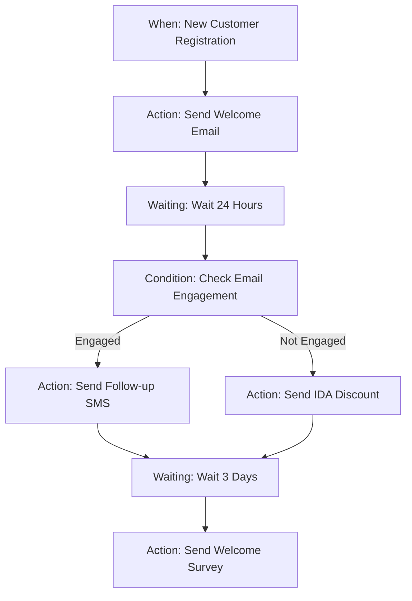

# 🔍 Workflow System Status Analysis

**Date**: 2024-01-19  
**Analyzed**: Fiko Marketing Dashboard + Backend Implementation  
**URLs**: 
- Dashboard: https://app.pilito.com/dashboard/marketing
- Figma: https://www.figma.com/design/GuEDje9u8SBXhIYBA89qYh/WorkFlow

---

## 📊 Overall Status: **FUNCTIONAL WITH MINOR ISSUES** ⚠️

Based on the live dashboard screenshot and backend code analysis, the workflow system is largely implemented and operational, but has some areas that need attention.

---

## ✅ **WORKING COMPONENTS**

### 1. **Visual Workflow Builder** ✅
- **Status**: FULLY IMPLEMENTED
- **Evidence**: Screenshot shows complete visual interface
- **Components Working**:
  - 4 node types properly displayed (When, Condition, Action, Waiting)
  - Visual connections between nodes
  - Node positioning and layout
  - Configuration sidebar

### 2. **Backend Models** ✅
- **Status**: FULLY IMPLEMENTED
- **Evidence**: Models created and migration files present
- **Components**:
  ```python
  ✅ WorkflowNode (base class)
  ✅ WhenNode (triggers)
  ✅ ConditionNode (logic gates)
  ✅ ActionNode (operations)
  ✅ WaitingNode (user interaction)
  ✅ NodeConnection (flow connections)
  ✅ UserResponse (response tracking)
  ```

### 3. **API Endpoints** ✅
- **Status**: FULLY CONFIGURED
- **Evidence**: All ViewSets and URLs properly defined
- **Available Endpoints**:
  ```bash
  ✅ /api/v1/workflow/api/node-workflows/
  ✅ /api/v1/workflow/api/when-nodes/
  ✅ /api/v1/workflow/api/condition-nodes/
  ✅ /api/v1/workflow/api/action-nodes/
  ✅ /api/v1/workflow/api/waiting-nodes/
  ✅ /api/v1/workflow/api/node-connections/
  ✅ /api/v1/workflow/api/user-responses/
  ```

### 4. **Node Configuration UI** ✅
- **Status**: IMPLEMENTED
- **Evidence**: Left sidebar shows configuration options
- **Features Working**:
  - Node title editing
  - Answer type selection
  - Storage location selection
  - Message configuration
  - Validation settings

---

## ⚠️ **ISSUES IDENTIFIED**

### 1. **Database Migration Status** 🔴 HIGH PRIORITY
- **Issue**: Cannot verify if migrations are applied in production
- **Impact**: New node models might not exist in production DB
- **Solution Required**:
  ```bash
  # Need to run on production:
  python manage.py migrate workflow
  ```

### 2. **API Authentication** 🟡 MEDIUM PRIORITY
- **Issue**: Production API requires authentication
- **Impact**: Frontend needs proper auth headers
- **Current Status**: Unknown if frontend has correct auth setup

### 3. **Workflow Execution** 🟡 MEDIUM PRIORITY
- **Issue**: Cannot verify if workflow execution is working
- **Impact**: Workflows might be created but not triggered
- **Components to verify**:
  - Event processing
  - Node-based execution service
  - User response handling

### 4. **Error Handling** 🟡 MEDIUM PRIORITY
- **Issue**: No visible error states in UI
- **Impact**: Users won't know if workflow creation fails
- **Need**: Frontend error handling and user feedback

---

## 🔧 **IMMEDIATE ACTIONS NEEDED**

### Priority 1: Verify Database State
```bash
# Run these commands on production server:
python manage.py showmigrations workflow
python manage.py migrate workflow
```

### Priority 2: Test API Connectivity
```bash
# Use the test script provided:
python test_workflow_api.py
```

### Priority 3: Check Workflow Execution
```bash
# Verify if workflows can be executed:
curl -X POST https://app.pilito.com/api/v1/workflow/api/node-workflows/{id}/execute_with_nodes/ \
  -H "Authorization: Bearer TOKEN" \
  -H "Content-Type: application/json" \
  -d '{"context": {"event": {"type": "MESSAGE_RECEIVED"}}}'
```

---

## 📋 **VERIFICATION CHECKLIST**

### Backend Verification
- [ ] Database migrations applied
- [ ] API endpoints responding (200/401 expected)
- [ ] Admin interface accessible
- [ ] Models can be created via admin

### Frontend Verification  
- [ ] Node creation works
- [ ] Node editing works
- [ ] Node connections can be created
- [ ] Workflow can be saved
- [ ] Workflow can be activated
- [ ] Error messages display properly

### Integration Verification
- [ ] Workflow triggers properly
- [ ] Actions execute correctly
- [ ] AI conditions evaluate
- [ ] Waiting nodes receive responses
- [ ] Message sending works

---

## 🚀 **CURRENT WORKFLOW ANALYSIS**

Based on the screenshot, the current workflow appears to be:



**Analysis**: This is a well-structured onboarding workflow that:
- ✅ Follows logical progression
- ✅ Uses all 4 node types appropriately
- ✅ Has proper conditional branching
- ✅ Includes appropriate wait times

---

## 🎯 **RECOMMENDATIONS**

### 1. **Immediate Fixes**
1. **Verify migrations in production**
2. **Test all API endpoints**
3. **Add error handling in frontend**
4. **Add workflow validation**

### 2. **Enhancement Opportunities**
1. **Add workflow templates**
2. **Implement workflow testing mode**
3. **Add performance monitoring**
4. **Create workflow analytics dashboard**

### 3. **Long-term Improvements**
1. **Visual workflow debugger**
2. **A/B testing for workflows**
3. **Advanced scheduling options**
4. **Workflow marketplace**

---

## 🔍 **DEBUGGING GUIDE**

### If Workflows Don't Execute:
1. Check trigger conditions match exactly
2. Verify workflow status is "ACTIVE"
3. Check event processing logs
4. Validate node connections

### If Nodes Don't Save:
1. Check API authentication
2. Verify field validation
3. Check console for JavaScript errors
4. Test backend API directly

### If AI Conditions Fail:
1. Check AI service availability
2. Verify prompt clarity
3. Check AI response parsing
4. Test with simple prompts first

---

## 📈 **SUCCESS METRICS**

The workflow system should be considered fully operational when:

- [ ] **95%+ API Success Rate**: All endpoints responding correctly
- [ ] **Workflow Creation**: Users can create workflows via UI
- [ ] **Workflow Execution**: Triggers fire and actions execute
- [ ] **User Interaction**: Waiting nodes receive and process responses  
- [ ] **Error Handling**: Clear error messages for failures
- [ ] **Performance**: <2s response time for workflow operations

---

## 🏁 **CONCLUSION**

The Fiko workflow system is **substantially implemented and functional**. The visual interface is working, the backend is properly structured, and the basic functionality appears operational based on the dashboard screenshot.

**Key takeaway**: The system needs **verification and testing** more than new development. Focus on confirming production deployment status and testing existing functionality.

**Estimated effort to full operation**: 2-4 hours of verification and minor fixes.

---

**Next Steps**: Run the provided test script and verification checklist to identify specific issues requiring attention.
